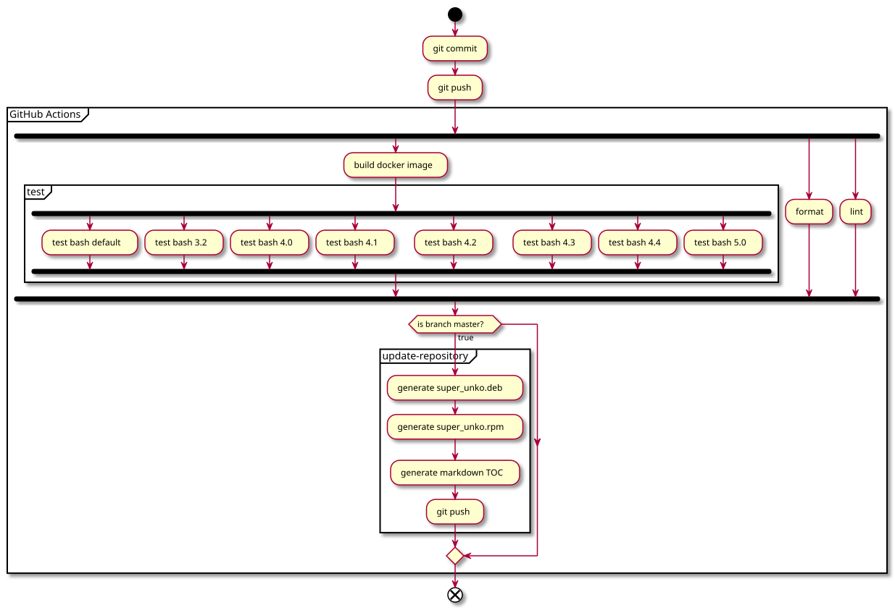

<h1 align="center">
  
</h1>

[](./LICENSE)
[](https://travis-ci.org/unkontributors/super_unko)
[](https://coveralls.io/github/unkontributors/super_unko?branch=oshiri)


super_unko project is the one of the awesome, clean and sophisticated OSS project in the world.
Let's create poop commands!

super_unko プロジェクトは世界で最もクリーンで洗練されたOSSプロジェクトの一つです。
うんこなコマンドを作りましょう。

Table of Contents

<!--ts-->
* [Commands](README.md#commands)
* [Installation](README.md#installation)
   * [Linux](README.md#linux)
      * [With yum (RHEL compatible distros)](README.md#with-yum-rhel-compatible-distros)
      * [With apt (Debian base distros)](README.md#with-apt-debian-base-distros)
      * [With AUR (ArchLinux base distros)](README.md#with-aur-archlinux-base-distros)
   * [macOS](README.md#macos)
   * [Docker](README.md#docker)
   * [Zsh plugin manager](README.md#zsh-plugin-manager)
   * [Additional Installation](README.md#additional-installation)
* [Usage](README.md#usage)
* [Development](README.md#development)
   * [Codestyle and lint](README.md#codestyle-and-lint)
      * [Help](README.md#help)
      * [Code format](README.md#code-format)
      * [Code format and save](README.md#code-format-and-save)
      * [Code lint](README.md#code-lint)
      * [Code format and lint](README.md#code-format-and-lint)
   * [Testing](README.md#testing)
   * [CI workflow](README.md#ci-workflow)
* [Contribution](README.md#contribution)
* [LICENSE](README.md#license)
   * [Source Code](README.md#source-code)
   * [Logo](README.md#logo)
* [History](README.md#history)
* [For Unkontributors (開発者向け)](README.md#for-unkontributors-開発者向け)

<!-- Created by https://github.com/ekalinin/github-markdown-toc -->
<!-- Added by: runner, at: Wed Jun 17 16:46:58 UTC 2026 -->

<!--te-->

Commands
========================

| Command       | Description |
|---------------|-------------|
| super_unko    | Controles sub unkommands |
| unko.tr       | Convert various expressions equals to poop into 💩 (poop). |
| unko.ls       | Shows various poop expression. |
| unko.yes      | Generate 💩 poop forever. |
| unko.tower    | Build your poop tower. |
| unko.pyramid  | Build your poop pyramid. |
| bigunko.show  | Big poop. |
| unko.printpnm | Generate 💩 PNM image file. |
| unko.puzzle   | Sliding block puzzle. |
| unko.toilet   | Display large 💩 characters. |
| unko.grep     | Print lines matching a 💩 pattern. |
| unko.say      | King 💩 says a message. |
| unko.shout    | King 💩 shouts a message. |
| unko.think    | King 💩 thinks something. |
| unko.life     | Play 💩's game of life. |
| unko.any      | Simple wrapper to 💩 substitution for unko.shout. |
| unko.king     | Build your king shift tower. |
| unko.fizzbuzz | No need to implement FizzBuzz. |
| unko.ping     | Ping the 💩 domain. |
| unko.encode   | Encode/Decode data and print to standard output. |
| unko.date     | TBD |
| unko.awk      | TBD |
| unko.xargs    | TBD |

Installation
========================

## Linux

### With `yum` (RHEL compatible distros)

```
$ sudo yum install https://git.io/superunko.linux.rpm
```

Uninstall (not `super_unko`)

```
$ sudo yum remove superunko
```


### With `apt` (Debian base distros)

```
$ wget https://git.io/superunko.linux.deb
$ sudo dpkg -i ./superunko.linux.deb
```

Uninstall (not `super_unko`)

```
$ sudo apt remove superunko
```

### With AUR (ArchLinux base distros)

You can install `super_unko` from https://aur.archlinux.org/packages/super_unko-git/ with your favorite aur helper.

e.g. with yay:

```
$ yay -S super_unko-git
```

Uninstall (not `super_unko`)

```
$ sudo pacman -R super_unko-git
```

## macOS

* With Homebrew

```
$ brew tap unkontributors/unko
$ brew install super_unko
```

Uninstall

```
$ brew remove super_unko
```


## Docker

* With docker

```bash
$ git clone https://github.com/unkontributors/super_unko.git
$ cd super_unko
$ docker-compose build
$ docker-compose run super_unko unko.shout こんにちは
$ docker run --rm -it unkontributors/super_unko unko.shout こんにちは
```

## Zsh plugin manager

Zsh plugin managers like [antigen](https://github.com/zsh-users/antigen), [zplug](https://github.com/zplug/zplug) can be adoptive.
Not only commands can be used but also [`command_not_found_handler`](https://github.com/zsh-users/zsh/blob/master/README#L249) is updated.
It is extremely helpful for developers.

* Example of antigen

```
antigen bundle "unkontributors/super_unko"
```

## Additional Installation

- [unko.puzzle](./doc/unko.puzzle.md)
- unko.shout - Need a [echo-sd](https://github.com/fumiyas/home-commands) command
- unko.say - Need a `cowsay` command (`$ apt install cowsay`)
- unko.think - Need a `cowthink` command (`$ apt install cowsay`)
- unko.toilet - Need a `toilet` command (`$ apt install toilet`)

Usage
========================

```
$ echo "うんこ" | unko.tr
💩

$ echo "うんち" | unko.tr
💩

$ ./unko.yes
💩
💩
💩
💩
💩
💩
💩
...
```

Development
========================

## Codestyle and lint

We are checking code with [shfmt](https://github.com/mvdan/sh) and [shellcheck](https://github.com/koalaman/shellcheck).
Please check your code by `linter.sh` if you want to add your origin unko commands.
We must provide clean unkos.
So, please run below and pass all checkings.

```bash
make setup

make lint
# or
./linter.sh
```

`linter.sh` checks your code or all code of this project.
**`linter.sh` depends on `docker` and `docker-compose` commands.**
And you **don't** need to install `shfmt` and `shellcheck`.

Usage examples of `linter.sh` are below.

### Help

```bash
./linter.sh help
```

### Code format

```bash
./linter.sh format
```

### Code format and save

```bash
./linter.sh format-save
```

### Code lint

```bash
./linter.sh lint
```

### Code format and lint

```bash
./linter.sh all
```

## Testing

We use the [bats](https://github.com/sstephenson/bats) testing framework.
`test.sh` calls the `bats`. But you **don't** need to install `bats`.
Test tasks use `docker` and the `docker` uses `bats` internally and runs tests.

Run below for testing.

```bash
make setup ## Need long times to build docker images.
make test
```

Run below for testing on multiple Bash versions.
Please do that and fix it if tests failed on CI.

```bash
make check
make test-bash-version
```

## CI workflow

CI workflow runs when you pushed.
Workflow diagram is below.



Contribution
========================
Welcome! Welcome!

LICENSE
==============

## Source Code
💩 LICENSE
 (Something like BSD license)

## Logo
Creative 💩 license
(Something like public domain)

History
==============

* [シェル芸勉強会中に爆誕したsuper_unkoリポジトリを巡る悲喜交々 - Togetter](https://togetter.com/li/1144376)
* [【まとめたくない】super_unkoリポジトリがスクスク成長【義務感】 - Togetter](https://togetter.com/li/1145304)

For Unkontributors (開発者向け)
========================

Please put your commands under `bin` directory.
Run `bash package.sh` on a host which `docker` installed to generate multiple installer packages under `pkg` directory.

Codebase is supposed to be scanned with code formatter and static analysis tools to ensure the quality of the code.
Please make sure prepared static checks are passed by running `./liner.sh all` before submitting your PR.
It would be appreciated if you could add tests to `./test.sh`.

Please make sure the default branch of this repository is `oshiri` (which means "bum") not `master`.

bin 以下になんか思いついたコマンドを放り投げてください。
docker が入った環境で `bash package.sh` すると pkg 以下に各種インストーラーが作成されます。

CIでコードフォーマットと静的解析にかけてコード品質を維持するようになりました。
PRするときは`./linter.sh all`で静的解析をパスすることを確認してください。

可能なら`./test.sh`にもテストコードを追加していただけると助かります。

なお、このリポジトリのデフォルトのブランチは`oshiri`であり`master`ではありません。
